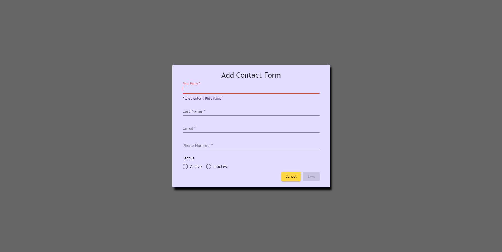
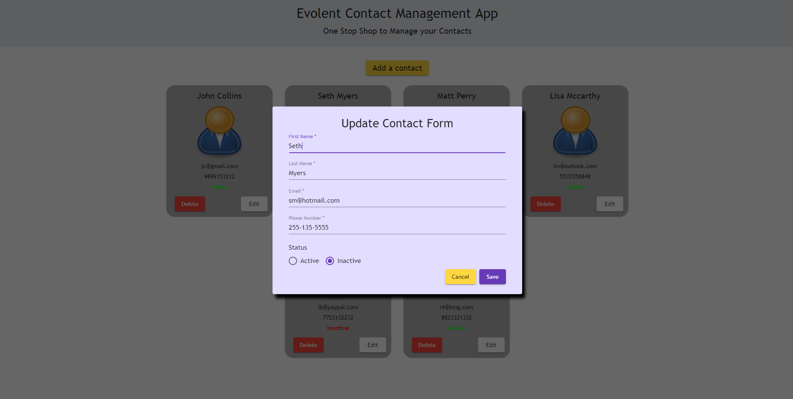
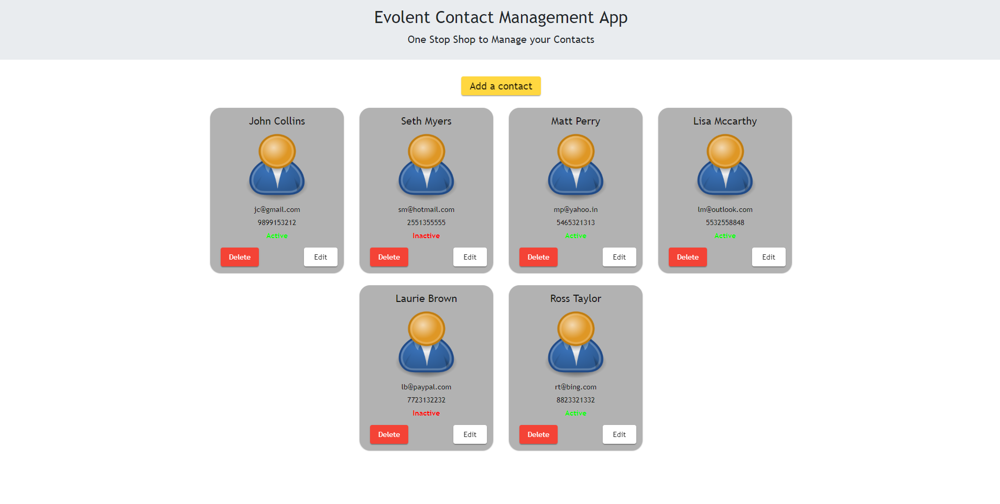
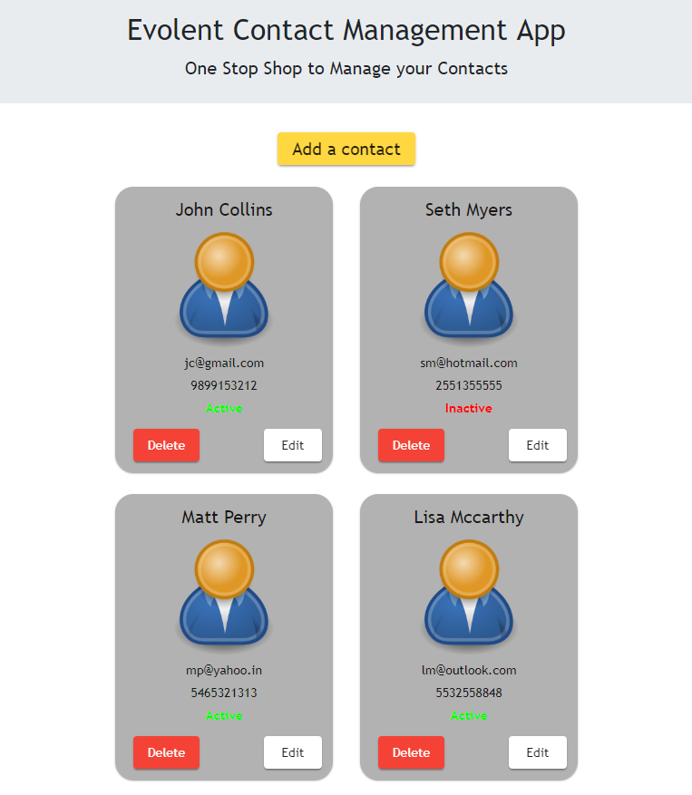

# EvolentContactApp

This app is meant to work as a contact management application.

Live-Demo of the application can be found [here(DEMO)](https://prashant-evolent.firebaseapp.com)

## Installation and Setup

> Make sure you have the Node version 10+ installed on you machine.
> Run `npm install` to install all the dependencies.
> Once the dependencies are installed, run the command `npm start or ng serve` and navigate to `http://localhost:4200`.

> You can also visit the Live-Demo link mentioned above.

---

# Screenshots

## When no Contacts are found

---

## Adding a contact

---

## Editing a contact

---

## Contacts Views

---

